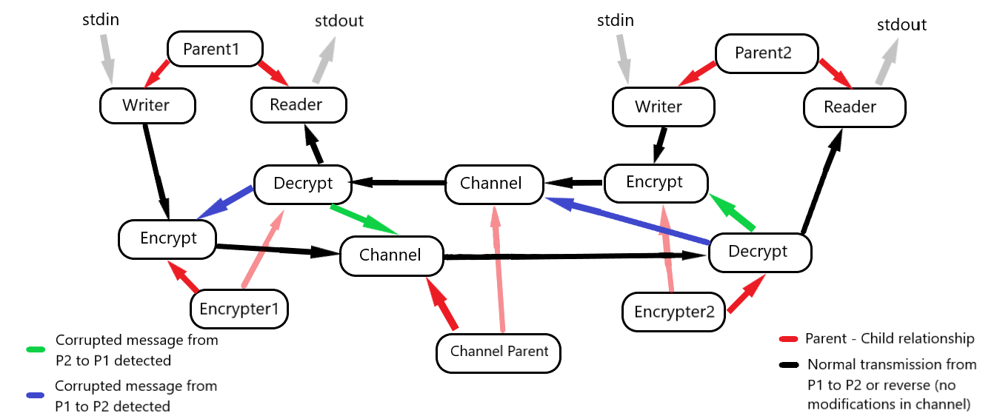

### Pavlos Spanoudakis (sdi1800184)
## Project 1 on Operating Systems class
## Documentation & Additional comments
***
### Project structure
- `utils.c` & `utils.h` : Implementation & definition for useful functions, as well as some `#define` commands that may be modified (shared memory size, permissions, termination message)
- `parent1.c` & `parent2.c` : Parent processes of P1 and P2 respectively. 
- `writer.c` : Used by P1 and P2, to get a new message from the command line and send it.
- `reader.c` : Also used by P1 and P2. It is the final "destination" of a message, where it is displayed in the command line.
- `encrypter1.c` and `encrypter2.c` : Parent processes for ENC1 and ENC2 respectively.
- `encrypt.c` : Used in ENC1 and ENC2. The main task of it is to get a message, concatenate it with the respective hash code and forward it to the channel.
- `decrypt.c` : Also used in ENC1 and ENC2. Mainly used to validate a message using the hash code and forward it to its final destination (either P1 or P2).
- `channel_parent.c` : Parent process of CHAN.
- `channel.c` : The "real" channel, where noise may by added to a message.

### Logic & Design
The general idea is to create 2 identical & independent paths: one to send a message from P1 to P2, and another to do the opposite. 

There are 5 parent processes to be executed:
- `parent1` and `parent2`, which call `writer` & `reader`
- `encrypter1` and `encypter2` which call `encrypt` & `decrypt`
- `channel_parent`, which calls `channel` 2 times (with different arguments)

After the parent processes create their children using `execvp`, they let them do the real job and wait for them to finish.  
Each of the edges in the above diagram is created using a shared memory segment and 2 semaphores, to sychronize the producer and the consumer properly. Each process acts both as a **consumer** and as a **producer** (with the exception of `writer`, who "consumes" from `stdin` and `reader` whose "products" are directed to `stdout`).  

Each child process runs a loop which stops in case of a termination message. At the begin of the loop, the process waits to read data from a source (either `stdin` or a shared memory segment) in order to write it to the destination (either `stdout` or another shared memory segment).

The first destination of a message is the `writer`, who waits to receive it from stdout. Consequently, `encrypt` waits for `writer` to give it permission to read from the shared memory segment. `channel` waits for `encrypt`, `decrypt` waits for `channel`, and `reader` waits for decrypt. Thanks to the first semaphore, "waiting" does not mean "looping until the producer writes something" but being blocked until the respective semaphore is unlocked. When this happens, the consumer reads from the shared memory. Thanks to the second semaphore, the producer cannot re-write until reading has finished.  

The whole procedure is identical, no matter if P1 sent something to P2 or reverse.
The only thing that changes is the shared memory and semaphores. The parent processes provide both the reading and writing shared memory and semaphore keys to their children (as arguments). They are created with `#define` commands in the parent's source code and can be easily modified, but with a lot of attention.

### Corrupting a message, Rejecting & Retransmitting
The channel parent must receive an argument, an integer which should be between 0 and 100. If greater than 100, it's like giving 100 and if smaller than 0, it's like giving 0. This is the % possibilty of a message being modified while "passing through" a channel child. The channel parent just passes it to the child as an argument. The child, after receiving a message (unless it is a "special" message), makes a simple `rand()` call:  

    if ( (rand() % 100) < chance )
    {
        // modify the message
    }

where `chance` is the argument mentioned above.  

If `channel` modifies the message, `decrypt` will know, by checking if the hash code (which is never modified) is the right for this message. Let's assume a message from **P1 to P2** was modified.  
In that case, instead of sending it to `reader`, `decrypt` writes a **special** message (`#define`'d in `utils.h`) to the shared memory where its **brother** (`encrypt`) usually **writes** to send a message from **P2 to P1** (see the blue arrows in the diagram).  
The special message passes through the channel and is received this time by P1's `decrypt`. When `decrypt` receives that special message, it sends it to its **brother** `encrypt`, by writing it to the shared memory where `encrypt` **reads** from to send a message from **P1 to P2**.  
When `encrypt` receives that message, it "retransmits" the last message that was sent (practically, the message is already in the shared memory, so `encrypt` just uses the semaphores to let `channel` read it again). Of course, the message may be modified again.  

`decrypt` and `encrypt` print some messages to inform when a modification and a retransmission have taken place.  

The exact same procedure takes place when a message from P2 to P1 is modified by the channel (see the green arrows in the diagram).

### Terminating & Releasing resources
Another special message is **TERM**, which indicates the termination of all the processes. Each process is designed to terminate after the handling of that message.   
Since the two paths are independent, if P1 sends an exit message to P2, only half of the running processes will read it at some point.  
After P2 `reader` terminates, `parent2` is **awaken** and sends a `SIGTERM` at `writer`. This is the step that will lead to the termination of the rest of the processes.  
Each process that is about to terminate also attempts to delete the semaphore that handles the shared memory for **writing**.  
At the same time, the process that **reads** from that segment checks if a semaphore operation **fails**, which will happen if the semaphore has been deleted. When the operation fails, this process is also terminated smoothly (freeing any allocated memory, detaching pointers to shared memory segments and deleting semaphores) and will "inform" the next one in the exact same way.

### Compiling & Executing
Running `make` will create all the needed executables.  
gcc normally displays a warning (`"assignment discards ‘const’ qualifier"`) 2 times while compiling `channel_parent.c`. It is disabled in the Makefile, but can easily be enabled back.

`parent1`, `parent2` and `channel_parent` should be executed first, in different terminals (in any order). Then `encrypter1` and `encrypter2` need to be executed. They should **ALWAYS** be executed last, because they do not initiallize the semaphores they use themselves. `channel_parent`, `encrypter1` and `encrypter2` could be executed in one terminal (in backround) but it would be more preferable to use different terminals since `channel` processes print message modification messages, while `encrypt` and `decrypt` print retransmission messages.  
`channel_parent` needs to be executed along with the possibility argument, otherwise it will stop.

After all the above have been executed, just type anything in `parent1` or `parent2` terminal and it will show up in the other's. Note that a message may be modified more than 1 time in a row.

To terminate, type "TERM" (or whatever exit message has been defined in `utils.h`), either in `parent1` or `parent2` terminal, and everything will stop.

To delete the executables and objective files, run `make clean`.

### Performance, Resource Handling & other details
Messages should appear immediately in the destination terminal, even if a retransmission has taken place (unless the possibility for modification in channel is very big). You can check for output messages in `encrypter1` and `encrypter2` terminals to find out.

All processes have been extensively checked for memory leaks using valgrind, and no leaks have being reported in multiple executions and different scenarios.
Semaphores and shared memory segments are properly deleted, and any attached pointers are dettached without problems.

The default shared memory size is 100 bytes but can be changed in `utils.h`. While reading input, `writer` will check if the length of the message along with the MD5 digest length exceed this limit, and will reject the input message in such case.

### Development & Testing
Developed and extensively tested in WSL Ubuntu 20.04, using Visual Studio Code. Succesfully tested in DIT Lab Ubuntu 16.04 as well.
